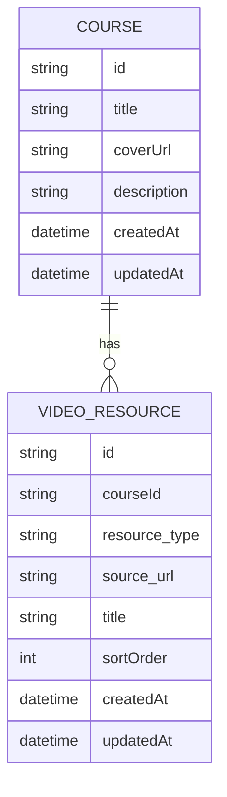

## 1.Architecture design
```mermaid
graph TD
  A["用户浏览器"] --> B["前端管理后台（Vue 应用）"]
  B --> C["HTTP API（/api）"]
  C --> D["后端服务（Express）"]
  D --> E["Prisma ORM"]
  E --> F["MySQL 数据库"]

  subgraph "Frontend Layer"
    B
  end

  subgraph "Backend Layer"
    D
    E
  end

  subgraph "Data Layer"
    F
  end
end
```

## 2.Technology Description
- Frontend: Vue@3 + TypeScript + vite +（现有样式体系/utility class）
- Backend: Express@4 + TypeScript + Prisma
- Database: MySQL
- Admin Auth: Header Token（x-admin-token 或 Authorization: Bearer）

## 3.Route definitions
| Route | Purpose |
|-------|---------|
| /admin | 管理后台入口，课程列表（搜索/筛选/分页）与课程管理入口 |
| /admin/courses/:id | 课程编辑页：课程信息编辑、资源增删改与排序 |
| /courses/:id | 前台课程详情预览（供管理员快速核对效果） |

## 4.API definitions
> 本期目标：让“课程列表搜索/筛选/分页”与“资源增删改/排序、课程编辑”都有明确可对齐的后端接口。

### 4.1 Types (Frontend/Backend shared)
```ts
export type VideoResourceType = 'local' | 'youtube' | 'bilibili' | 'external_link'

export type VideoResourceDto = {
  id: string
  courseId: string
  resource_type: VideoResourceType
  source_url: string
  title: string | null
  sortOrder: number
  createdAt: string
  updatedAt: string
}

export type CourseDto = {
  id: string
  title: string
  coverUrl: string | null
  description: string | null
  createdAt: string
  updatedAt: string
  resources: VideoResourceDto[]
}

export type PagedResult<T> = {
  items: T[]
  page: number
  pageSize: number
  total: number
}
```

### 4.2 Course list (search/filter/pagination)
```
GET /api/courses
```
Query（对齐前端列表能力）：
| Param | Type | Required | Description |
|------|------|----------|-------------|
| q | string | false | 课程标题关键字（模糊匹配） |
| resource_type | string | false | 资源类型筛选（local/youtube/bilibili/external_link） |
| page | number | false | 页码，从 1 开始 |
| pageSize | number | false | 每页条数 |

Response（建议统一为分页结构，便于前端落地）：
```json
{ "ok": true, "data": { "items": [], "page": 1, "pageSize": 20, "total": 0 } }
```

### 4.3 Course edit
```
PUT /api/courses/:id
```
Headers（管理员）：
- x-admin-token: <token> 或 Authorization: Bearer <token>

Request:
| Param | Type | Required | Description |
|------|------|----------|-------------|
| title | string | true | 课程标题 |
| coverUrl | string | false | 封面 URL |
| description | string | false | 课程描述 |

### 4.4 Resource CRUD
```
POST /api/courses/:courseId/resources
PUT  /api/courses/:courseId/resources/:resourceId
DELETE /api/courses/:courseId/resources/:resourceId
```
Request（POST/PUT）：
| Param | Type | Required | Description |
|------|------|----------|-------------|
| resource_type | VideoResourceType | true | 资源类型 |
| source_url | string | true | 资源定位（URL/ID/Path） |
| title | string | false | 资源标题 |

### 4.5 Resource sorting
```
PUT /api/courses/:courseId/resources/sort
```
Request:
```json
{ "resourceIds": ["r1","r2","r3"] }
```
约定：后端按数组顺序重写 sortOrder（从 0 或 1 递增），并返回更新后的 CourseDto 或资源列表。

## 6.Data model
### 6.1 Data model definition


### 6.2 Data Definition Language
Course（courses）
```sql
CREATE TABLE courses (
  id VARCHAR(191) PRIMARY KEY,
  title VARCHAR(200) NOT NULL,
  coverUrl VARCHAR(2048) NULL,
  description TEXT NULL,
  createdAt DATETIME NOT NULL,
  updatedAt DATETIME NOT NULL
);
```
VideoResource（video_resources）
```sql
CREATE TABLE video_resources (
  id VARCHAR(191) PRIMARY KEY,
  courseId VARCHAR(191) NOT NULL,
  resource_type VARCHAR(32) NOT NULL,
  source_url TEXT NOT NULL,
  title VARCHAR(200) NULL,
  sortOrder INT NOT NULL DEFAULT 0,
  createdAt DATETIME NOT NULL,
  updatedAt DATETIME NOT NULL,
  INDEX idx_video_resources_courseId (courseId)
);
```
