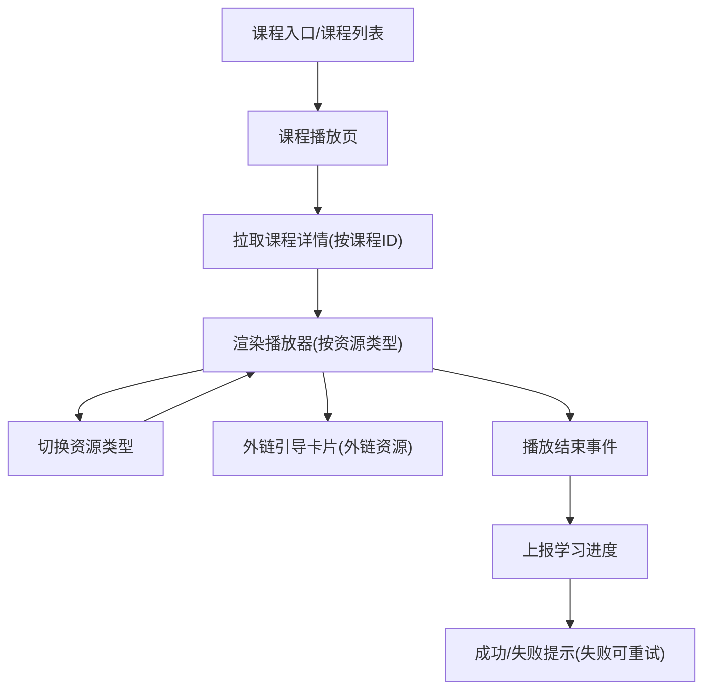

## 1. Product Overview

课程播放页重构：进入页面后按课程ID拉取课程详情，并按资源类型切换播放器，支持外链资源引导卡片与播放结束进度上报。
面向学习者提供稳定一致的课程观看与进度记录体验。

## 2. Core Features

### 2.1 Feature Module

本次需求包含以下页面：

1. **课程播放页**：按课程ID拉取详情、资源类型切换播放器、外链引导卡片、播放结束上报进度。

### 2.3 Page Details

| Page Name | Module Name | Feature description                                          |
| --------- | ----------- | ------------------------------------------------------------ |
| 课程播放页     | 路由参数与初始化    | 读取课程ID（courseId），初始化页面加载状态（加载中/成功/失败/空数据）。                   |
| 课程播放页     | 课程详情拉取      | 按 courseId 请求课程详情；渲染课程标题、简介（若有）、当前资源信息与资源类型。                 |
| 课程播放页     | 播放器容器       | 根据当前资源类型渲染对应播放器容器；在切换资源类型时销毁/重建播放实例，避免残留音视频。                 |
| 课程播放页     | 资源类型切换      | 提供资源类型切换入口（如 Tab/分段控制器）；切换后更新当前资源与播放器渲染状态。                   |
| 课程播放页     | 外链引导卡片      | 当资源类型为外链时，展示外链引导卡片：域名/标题（若有）、风险提示文案（可选）、“打开外链”按钮；在新标签页打开。    |
| 课程播放页     | 播放完成与进度上报   | 监听播放结束事件；结束时上报学习进度（课程ID、资源ID、完成状态/完成时间等）；展示上报成功/失败提示（失败可重试）。 |
| 课程播放页     | 异常处理        | 处理接口失败、资源不可用、外链缺失等：展示错误态与返回/重试入口。                            |

## 3. Core Process

你从课程入口进入课程播放页后，页面会携带 courseId 初始化并拉取课程详情；详情返回后按默认资源类型渲染播放器。你可通过资源类型切换控件在不同类型间切换，页面会替换播放器实现。若当前资源为外链，页面展示外链引导卡片，你点击“打开外链”将在新标签页打开。你观看/学习至播放结束时，系统监听结束事件并上报进度；若上报失败，你可在提示中点击重试。

