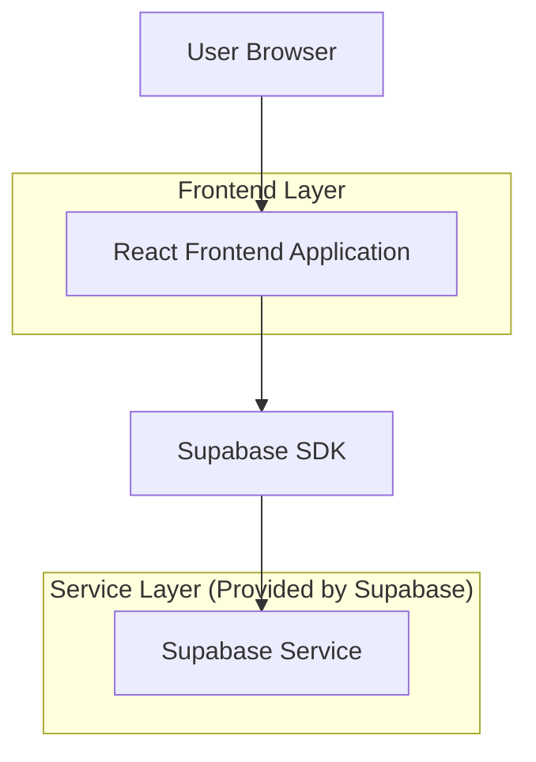
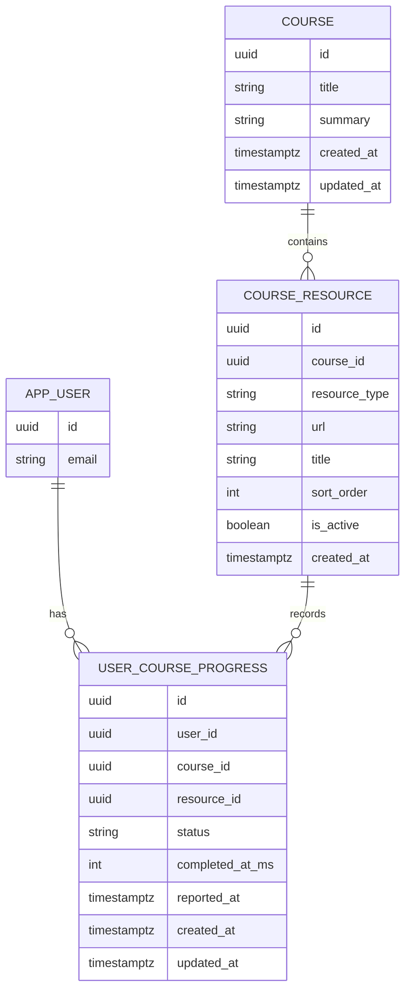

## 1.Architecture design


## 2.Technology Description
- Frontend: React@18 + TypeScript + vite + tailwindcss@3
- Backend: Supabase（Auth + PostgreSQL）

## 3.Route definitions
| Route | Purpose |
|-------|---------|
| /courses/:courseId/play | 课程播放页：按课程ID拉取课程详情，按资源类型切换播放器，外链引导卡片，播放结束上报进度 |

## 6.Data model(if applicable)

### 6.1 Data model definition


### 6.2 Data Definition Language
Course Table (courses)
```sql
CREATE TABLE IF NOT EXISTS courses (
  id UUID PRIMARY KEY DEFAULT gen_random_uuid(),
  title TEXT NOT NULL,
  summary TEXT,
  created_at TIMESTAMPTZ NOT NULL DEFAULT now(),
  updated_at TIMESTAMPTZ NOT NULL DEFAULT now()
);

GRANT SELECT ON courses TO anon;
GRANT ALL PRIVILEGES ON courses TO authenticated;
```

Course Resource Table (course_resources)
```sql
CREATE TABLE IF NOT EXISTS course_resources (
  id UUID PRIMARY KEY DEFAULT gen_random_uuid(),
  course_id UUID NOT NULL,
  resource_type TEXT NOT NULL CHECK (resource_type IN ('video','audio','pdf','h5','external')),
  url TEXT NOT NULL,
  title TEXT,
  sort_order INT NOT NULL DEFAULT 0,
  is_active BOOLEAN NOT NULL DEFAULT true,
  created_at TIMESTAMPTZ NOT NULL DEFAULT now()
);

CREATE INDEX IF NOT EXISTS idx_course_resources_course_id_sort
  ON course_resources(course_id, sort_order);

GRANT SELECT ON course_resources TO anon;
GRANT ALL PRIVILEGES ON course_resources TO authenticated;
```

User Course Progress Table (user_course_progress)
```sql
CREATE TABLE IF NOT EXISTS user_course_progress (
  id UUID PRIMARY KEY DEFAULT gen_random_uuid(),
  user_id UUID NOT NULL,
  course_id UUID NOT NULL,
  resource_id UUID,
  status TEXT NOT NULL CHECK (status IN ('completed')),
  completed_at_ms INT,
  reported_at TIMESTAMPTZ NOT NULL DEFAULT now(),
  created_at TIMESTAMPTZ NOT NULL DEFAULT now(),
  updated_at TIMESTAMPTZ NOT NULL DEFAULT now()
);

CREATE INDEX IF NOT EXISTS idx_progress_user_course
  ON user_course_progress(user_id, course_id, reported_at DESC);

-- 进度上报通常需要登录态
GRANT SELECT ON user_course_progress TO authenticated;
GRANT ALL PRIVILEGES ON user_course_progress TO authenticated;
```

Initial Data (示例)
```sql
INSERT INTO courses (title, summary)
VALUES ('示例课程', '用于本地联调的示例数据');
```