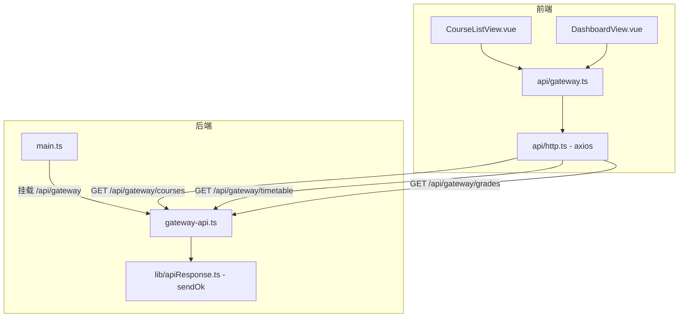

# 设计文档：语言培训学校门户与教务系统

## 1. 概览

本次改造将现有 Vue 3 视频网课平台重构为语言培训学校的门户与教务系统。核心变更包括：

- **后端**：重写 `gateway-api.ts`，移除对 legacy-api 的内部调用，改为直接返回符合新数据契约的 Mock 静态数据。
- **前端 API 层**：新增 `frontend/src/api/gateway.ts`，定义网关接口的 TypeScript 类型和请求函数。
- **CourseListView**：完整重写，移除视频学习组件，新增语种分类 Tabs，课程卡片展示教务字段。
- **DashboardView**：完整重写，新增"我的课表"和"成绩与出勤"两个教务模块。

## 2. 架构概览

### 2.1 组件关系图



### 2.2 数据流

```
用户操作
  → Vue 组件（状态变更）
    → gateway.ts（类型安全的 API 函数）
      → http.ts（axios 实例，baseURL = VITE_API_BASE_URL）
        → Express /api/gateway/*（gateway-api.ts）
          → sendOk(res, mockData)
            → { ok: true, data: [...] }
```

## 3. 后端：gateway-api.ts 重写方案

### 3.1 重写策略

现有 `gateway-api.ts` 依赖对 legacy-api 的内部 HTTP 调用，字段名与需求不符。重写方案：

- 移除所有 `fetchLegacy` 调用和 Legacy 接口类型定义
- 移除 `formatCourse`、`formatTimetableEntry`、`formatGradeEntry` 适配函数
- 直接在路由处理函数中返回符合数据契约的 Mock 静态数据
- 使用 `sendOk` 工具函数统一响应格式
- 支持 `language` 和 `q` 查询参数对 courses 进行内存过滤（演示筛选逻辑）

### 3.2 Mock 数据结构

#### GET /api/gateway/courses

```typescript
// 查询参数：language?: string, q?: string
// 响应：{ ok: true, data: GatewayCourse[] }

const MOCK_COURSES: GatewayCourse[] = [
  { id: "c001", title: "英语口语 B2", level: "B2", schedule: "周一/周三 19:00–21:00", teacher: "张老师", language: "英语", coverUrl: null },
  { id: "c002", title: "英语写作 C1", level: "C1", schedule: "周二/周四 18:00–20:00", teacher: "李老师", language: "英语", coverUrl: null },
  { id: "c003", title: "俄语入门 A1", level: "A1", schedule: "周六 10:00–12:00", teacher: "伊万老师", language: "俄语", coverUrl: null },
  { id: "c004", title: "法语入门 A1", level: "A1", schedule: "周五 19:00–21:00", teacher: "玛丽老师", language: "法语", coverUrl: null },
  { id: "c005", title: "日语 N3 强化", level: "B1", schedule: "周二/周五 20:00–22:00", teacher: "田中老师", language: "日语", coverUrl: null },
  { id: "c006", title: "法语进阶 B1", level: "B1", schedule: "周三/周六 14:00–16:00", teacher: "皮埃尔老师", language: "法语", coverUrl: null },
];
```

**过滤逻辑**（内存过滤，演示筛选功能）：

```typescript
router.get("/courses", (req, res) => {
  const { language, q } = req.query;
  let result = [...MOCK_COURSES];
  if (typeof language === "string" && language) {
    result = result.filter(c => c.language === language);
  }
  if (typeof q === "string" && q) {
    const keyword = q.toLowerCase();
    result = result.filter(c =>
      c.title.toLowerCase().includes(keyword) ||
      (c.teacher && c.teacher.toLowerCase().includes(keyword))
    );
  }
  sendOk(res, result);
});
```

#### GET /api/gateway/timetable

```typescript
// 查询参数：studentId?: string（当前阶段不做鉴权，忽略值直接返回 Mock）
// 响应：{ ok: true, data: TimetableEntry[] }

const MOCK_TIMETABLE: TimetableEntry[] = [
  { dayOfWeek: 1, courseName: "英语口语 B2", startTime: "19:00", endTime: "21:00", location: "3号楼 301教室" },
  { dayOfWeek: 3, courseName: "英语口语 B2", startTime: "19:00", endTime: "21:00", location: "3号楼 301教室" },
  { dayOfWeek: 5, courseName: "法语入门 A1", startTime: "19:00", endTime: "21:00", location: "2号楼 205教室" },
  { dayOfWeek: 6, courseName: "日语 N3 强化", startTime: "10:00", endTime: "12:00", location: "1号楼 102教室" },
];
```

#### GET /api/gateway/grades

```typescript
// 查询参数：studentId?: string（当前阶段不做鉴权，忽略值直接返回 Mock）
// 响应：{ ok: true, data: GradeEntry[] }

const MOCK_GRADES: GradeEntry[] = [
  { courseName: "英语口语 B2", semester: "2025春", grade: 88, attendanceRate: 95 },
  { courseName: "法语入门 A1", semester: "2025春", grade: null, attendanceRate: 80 },
  { courseName: "日语 N3 强化", semester: "2024秋", grade: 76, attendanceRate: 88 },
  { courseName: "俄语入门 A1", semester: "2024秋", grade: 92, attendanceRate: 100 },
];
```

## 4. 前端：gateway.ts API 层

### 4.1 文件路径

`frontend/src/api/gateway.ts`（新建，不修改现有 `course.ts`）

### 4.2 类型定义

```typescript
// 课程列表项
export type GatewayCourse = {
  id: string
  title: string
  level: string | null       // 如 "A1", "B2", "C1"；null 时显示"级别待定"
  schedule: string | null    // 如 "周一/周三 19:00–21:00"；null 时显示"时间待定"
  teacher: string | null     // 如 "张老师"；null 时显示"教师待定"
  language: string           // "英语" | "俄语" | "法语" | "日语"
  coverUrl: string | null
}

// 课程列表查询参数
export type CourseQuery = {
  language?: string          // 语种筛选，空字符串或 undefined 表示"全部"
  q?: string                 // 关键词搜索
}

// 课表条目
export type TimetableEntry = {
  dayOfWeek: number          // 1=周一, 2=周二, ..., 7=周日
  courseName: string
  startTime: string          // "HH:mm" 格式
  endTime: string            // "HH:mm" 格式
  location: string
}

// 成绩条目
export type GradeEntry = {
  courseName: string
  semester: string           // 如 "2025春"
  grade: number | null       // null 表示未评定
  attendanceRate: number     // 0–100 的整数
}

// 通用 API 响应包装
type ApiOk<T> = { ok: true; data: T }
```

### 4.3 函数签名

```typescript
import { http } from "./http"

/**
 * 获取课程列表
 * GET /api/gateway/courses?language=xxx&q=xxx
 */
export async function getGatewayCourses(query: CourseQuery = {}): Promise<GatewayCourse[]>

/**
 * 获取学生课表
 * GET /api/gateway/timetable?studentId=stu_001
 */
export async function getTimetable(studentId: string): Promise<TimetableEntry[]>

/**
 * 获取学生成绩与出勤
 * GET /api/gateway/grades?studentId=stu_001
 */
export async function getGrades(studentId: string): Promise<GradeEntry[]>
```

### 4.4 实现要点

- 所有函数通过 `http.get<ApiOk<T>>(url, { params })` 发起请求，返回 `res.data.data`
- 错误由调用方（Vue 组件）捕获，API 层不做 try/catch，保持职责单一
- `language` 为空字符串时不传递该参数（`undefined` 不会被 axios 序列化为查询参数）

## 5. 前端：CourseListView.vue 组件设计

### 5.1 状态（Reactive State）

```typescript
// 数据状态
const courses = ref<GatewayCourse[]>([])
const loading = ref(false)
const error = ref<string>("")

// 筛选状态
const selectedLanguage = ref<string>("")   // "" 表示"全部"
const searchInput = ref<string>("")

// 分页状态
const page = ref(1)
const PAGE_SIZE = 12

// 防抖计时器
let debounceTimer: ReturnType<typeof setTimeout> | null = null
const DEBOUNCE_MS = 400
```

### 5.2 常量

```typescript
const LANGUAGE_TABS = [
  { label: "全部", value: "" },
  { label: "英语", value: "英语" },
  { label: "俄语", value: "俄语" },
  { label: "法语", value: "法语" },
  { label: "日语", value: "日语" },
]
```

### 5.3 事件与方法

| 方法 | 触发时机 | 行为 |
|------|----------|------|
| `loadCourses()` | 初始化、筛选变更、重试 | 调用 `getGatewayCourses`，更新 `courses`/`loading`/`error` |
| `onLanguageChange(lang)` | 点击语种 Tab | 更新 `selectedLanguage`，重置 `page=1`，调用 `loadCourses` |
| `onSearchInput()` | 搜索框输入（防抖） | 重置 `page=1`，调用 `loadCourses` |
| `resetAll()` | 点击"重置"按钮 | 清空 `selectedLanguage` 和 `searchInput`，重置 `page=1`，调用 `loadCourses` |
| `goToPage(p)` | 点击分页按钮 | 更新 `page`，调用 `loadCourses` |

### 5.4 计算属性

```typescript
// 当前页展示的课程（前端分页，基于 courses 数组）
const pagedCourses = computed(() => {
  const start = (page.value - 1) * PAGE_SIZE;
  return courses.value.slice(start, start + PAGE_SIZE);
})

const totalPages = computed(() => Math.ceil(courses.value.length / PAGE_SIZE))
```

> **设计决策**：由于 Mock 数据量小，分页在前端完成。后端 API 一次返回所有匹配数据，前端按 PAGE_SIZE 切片展示。

### 5.5 UI 结构

```
<main>
  <!-- 页面标题 -->
  <header>
    <h1>课程列表</h1>
    <p>共 N 门课程</p>
  </header>

  <!-- 语种分类 Tabs（需求 2.1）-->
  <nav class="language-tabs">
    <button v-for="tab in LANGUAGE_TABS"
            :class="{ active: selectedLanguage === tab.value }"
            @click="onLanguageChange(tab.value)">
      {{ tab.label }}
    </button>
  </nav>

  <!-- 搜索栏 -->
  <input v-model="searchInput" placeholder="搜索课程名称或教师..." />

  <!-- 加载骨架屏（需求 4.5）-->
  <div v-if="loading" class="skeleton-grid">
    <div v-for="n in PAGE_SIZE" class="skeleton-card animate-pulse" />
  </div>

  <!-- 错误状态（需求 4.4）-->
  <div v-else-if="error" class="error-banner">
    <span>{{ error }}</span>
    <button @click="loadCourses">重试</button>
  </div>

  <!-- 空状态 -->
  <div v-else-if="courses.length === 0" class="empty-state">
    <p>暂无符合条件的课程</p>
    <button @click="resetAll">清空筛选</button>
  </div>

  <!-- 课程卡片网格（需求 3.1）-->
  <div v-else class="course-grid">
    <div v-for="course in pagedCourses" class="course-card">
      <!-- 封面图 -->
      
      <!-- 语种标签 -->
      <span class="language-badge">{{ course.language }}</span>
      <!-- 课程名称 -->
      <h3>{{ course.title }}</h3>
      <!-- 级别（需求 3.2）-->
      <span>{{ course.level ?? "级别待定" }}</span>
      <!-- 上课时间（需求 3.4）-->
      <span>{{ course.schedule ?? "时间待定" }}</span>
      <!-- 授课教师（需求 3.3）-->
      <span>{{ course.teacher ?? "教师待定" }}</span>
      <!-- 无视频来源标签（需求 3.5）-->
    </div>
  </div>

  <!-- 分页 -->
  <nav v-if="totalPages > 1" class="pagination">...</nav>
</main>
```

### 5.6 移除内容清单

以下内容在重写时**不再包含**（需求 1.x）：

- `<Player>` 组件及其 import
- Source 筛选侧边栏（local / YouTube / Bilibili / external_link）
- `SOURCE_OPTIONS` 常量
- `getCourseResourceTypes`、`tagLabel`、`tagClass` 辅助函数
- `VideoResourceType` 类型引用
- `resourceMeta` domain 模块引用
- 对 `@/api/course` 的 import（改为 `@/api/gateway`）

## 6. 前端：DashboardView.vue 组件设计

### 6.1 状态（Reactive State）

```typescript
const STUDENT_ID = "stu_001"

// 课表模块状态
const timetable = ref<TimetableEntry[]>([])
const timetableLoading = ref(false)
const timetableError = ref<string>("")

// 成绩模块状态
const grades = ref<GradeEntry[]>([])
const gradesLoading = ref(false)
const gradesError = ref<string>("")
```

### 6.2 计算属性

```typescript
// 将课表数据按 dayOfWeek 分组，生成周一至周日的完整视图
const weekDays = computed(() => {
  const DAY_NAMES = ["", "周一", "周二", "周三", "周四", "周五", "周六", "周日"]
  return Array.from({ length: 7 }, (_, i) => {
    const day = i + 1
    return {
      day,
      name: DAY_NAMES[day],
      entries: timetable.value
        .filter(e => e.dayOfWeek === day)
        .sort((a, b) => a.startTime.localeCompare(b.startTime)),
    }
  })
})
```

### 6.3 事件与方法

| 方法 | 触发时机 | 行为 |
|------|----------|------|
| `loadTimetable()` | `onMounted`、课表模块重试 | 调用 `getTimetable(STUDENT_ID)`，更新 `timetable`/`timetableLoading`/`timetableError` |
| `loadGrades()` | `onMounted`、成绩模块重试 | 调用 `getGrades(STUDENT_ID)`，更新 `grades`/`gradesLoading`/`gradesError` |

两个请求在 `onMounted` 中**并行发起**（`Promise.all` 或独立调用），互不阻塞。

### 6.4 UI 结构

```
<div class="dashboard">
  <!-- 顶部欢迎区 -->
  <header>
    <h1>个人中心</h1>
  </header>

  <main>
    <!-- ===== 我的课表模块（需求 5.x）===== -->
    <section class="timetable-section">
      <h2>我的课表</h2>

      <!-- 加载状态（需求 5.6）-->
      <div v-if="timetableLoading" class="loading-spinner">加载中...</div>

      <!-- 错误状态（需求 5.5）-->
      <div v-else-if="timetableError" class="error-banner">
        <span>{{ timetableError }}</span>
        <button @click="loadTimetable">重试</button>
      </div>

      <!-- 周视图（需求 5.3）-->
      <div v-else class="week-grid">
        <div v-for="dayInfo in weekDays" class="day-column">
          <h3>{{ dayInfo.name }}</h3>
          <!-- 今日无课占位（需求 5.4）-->
          <p v-if="dayInfo.entries.length === 0" class="no-class">今日无课</p>
          <!-- 课程条目 -->
          <div v-for="entry in dayInfo.entries" class="class-entry">
            <span class="course-name">{{ entry.courseName }}</span>
            <span class="time">{{ entry.startTime }}–{{ entry.endTime }}</span>
            <span class="location">{{ entry.location }}</span>
          </div>
        </div>
      </div>
    </section>

    <!-- ===== 成绩与出勤模块（需求 6.x）===== -->
    <section class="grades-section">
      <h2>成绩与出勤</h2>

      <!-- 加载状态（需求 6.6）-->
      <div v-if="gradesLoading" class="loading-spinner">加载中...</div>

      <!-- 错误状态（需求 6.5）-->
      <div v-else-if="gradesError" class="error-banner">
        <span>{{ gradesError }}</span>
        <button @click="loadGrades">重试</button>
      </div>

      <!-- 成绩表格（需求 6.3）-->
      <table v-else>
        <thead>
          <tr>
            <th>课程名称</th>
            <th>学期</th>
            <th>成绩</th>
            <th>出勤率</th>
          </tr>
        </thead>
        <tbody>
          <tr v-for="g in grades">
            <td>{{ g.courseName }}</td>
            <td>{{ g.semester }}</td>
            <!-- 未评定占位（需求 6.4）-->
            <td>{{ g.grade !== null ? g.grade : "未评定" }}</td>
            <td>{{ g.attendanceRate }}%</td>
          </tr>
        </tbody>
      </table>
    </section>
  </main>
</div>
```

### 6.5 保留内容

重写时保留现有 DashboardView 的整体布局风格（侧边导航、顶部栏、欢迎区），仅在主内容区替换为教务模块，移除视频学习相关的"继续学习"卡片和课程进度列表。

## 7. 数据模型

### 7.1 后端接口类型（TypeScript）

```typescript
// backend/src/routes/gateway-api.ts

interface GatewayCourse {
  id: string
  title: string
  level: string | null
  schedule: string | null
  teacher: string | null
  language: string
  coverUrl: string | null
}

interface TimetableEntry {
  dayOfWeek: number          // 1–7
  courseName: string
  startTime: string          // "HH:mm"
  endTime: string            // "HH:mm"
  location: string
}

interface GradeEntry {
  courseName: string
  semester: string
  grade: number | null
  attendanceRate: number     // 0–100
}
```

### 7.2 前后端字段映射

| 后端字段 | 前端类型字段 | 说明 |
|----------|-------------|------|
| `id` | `GatewayCourse.id` | 课程唯一标识 |
| `title` | `GatewayCourse.title` | 课程名称 |
| `level` | `GatewayCourse.level` | 可为 null，前端显示"级别待定" |
| `schedule` | `GatewayCourse.schedule` | 可为 null，前端显示"时间待定" |
| `teacher` | `GatewayCourse.teacher` | 可为 null，前端显示"教师待定" |
| `language` | `GatewayCourse.language` | 语种，用于 Tab 筛选 |
| `coverUrl` | `GatewayCourse.coverUrl` | 可为 null，前端使用默认封面 |
| `dayOfWeek` | `TimetableEntry.dayOfWeek` | 1=周一…7=周日 |
| `grade` | `GradeEntry.grade` | 可为 null，前端显示"未评定" |
| `attendanceRate` | `GradeEntry.attendanceRate` | 整数 0–100 |

## 8. 正确性属性（Correctness Properties）

*属性（Property）是在系统所有有效执行中都应成立的特征或行为——本质上是对系统应该做什么的形式化陈述。属性是人类可读规范与机器可验证正确性保证之间的桥梁。*

本功能涉及数据筛选逻辑、渲染逻辑和 API 响应结构，适合使用属性测试验证通用行为。

### Property 1：语种筛选参数传递

*对于任意*语种值（英语、俄语、法语、日语），当用户点击对应 Tab 时，`getGatewayCourses` 的调用参数中 `language` 字段应等于该语种值。

**Validates: Requirements 2.2**

### Property 2：Tab 高亮状态互斥

*对于任意*选中的语种 Tab，该 Tab 应具有高亮 CSS 类，且其余所有 Tab 均不具有高亮 CSS 类（互斥高亮）。

**Validates: Requirements 2.4**

### Property 3：语种切换重置分页

*对于任意*初始页码（大于 1）和任意语种切换操作，切换后 `page` 的值应为 1。

**Validates: Requirements 2.5**

### Property 4：课程卡片字段完整渲染

*对于任意*包含 `title`、`level`、`schedule`、`teacher` 字段的课程数据，渲染后的课程卡片 DOM 中应包含这四个字段的文本内容。

**Validates: Requirements 3.1**

### Property 5：空字段占位文本

*对于任意*课程数据，若 `level`、`schedule`、`teacher` 中任意字段为 null，则对应位置应分别显示"级别待定"、"时间待定"、"教师待定"。

**Validates: Requirements 3.2, 3.3, 3.4**

> **属性反思**：Property 4 和 Property 5 可合并为一个综合属性：对于任意课程数据（字段可为 null 或有值），卡片渲染结果中每个字段位置要么显示实际值，要么显示对应占位文本，二者必居其一。合并后覆盖更全面，避免冗余。

### Property 4+5（合并）：课程卡片字段渲染完整性

*对于任意*课程数据（各字段可为 null 或有值），渲染后的课程卡片中：
- `title` 字段始终显示实际值
- `level` 字段：有值时显示实际值，null 时显示"级别待定"
- `schedule` 字段：有值时显示实际值，null 时显示"时间待定"
- `teacher` 字段：有值时显示实际值，null 时显示"教师待定"

**Validates: Requirements 3.1, 3.2, 3.3, 3.4**

### Property 6：API 查询参数透传

*对于任意* `language` 和 `q` 参数的组合，`getGatewayCourses(query)` 发起的 HTTP 请求 URL 中应包含对应的查询参数（空值不传递）。

**Validates: Requirements 4.2**

### Property 7：API 响应结构完整性

*对于任意*对 `/api/gateway/courses` 的调用，响应中每个课程对象都应包含 `id`、`title`、`level`、`schedule`、`teacher`、`language`、`coverUrl` 字段（`ok: true`，`data` 为数组）。

**Validates: Requirements 4.3, 7.7**

### Property 8：课表按 dayOfWeek 排序渲染

*对于任意*顺序的课表数据，`weekDays` 计算属性应始终按 dayOfWeek 1→7 的顺序生成 7 个分组，每组内的课程按 startTime 升序排列。

**Validates: Requirements 5.3**

### Property 9：成绩 null 值显示"未评定"

*对于任意*包含 `grade: null` 的成绩记录数组，渲染后的表格中所有 `grade` 为 null 的行在成绩列均应显示"未评定"，而非空白或 "null"。

**Validates: Requirements 6.4**

### Property 10：timetable/grades API 响应结构完整性

*对于任意*对 `/api/gateway/timetable` 和 `/api/gateway/grades` 的调用，响应格式应为 `{ ok: true, data: [...] }`，且 `data` 数组中每条记录包含各自数据契约要求的所有字段。

**Validates: Requirements 5.7, 6.7, 7.7**

> **属性反思**：Property 7 和 Property 10 均测试 API 响应结构，可合并为"对于任意网关 API 调用，响应格式和字段完整性应符合各自数据契约"。但由于三个端点的字段不同，保持分开更清晰，便于定位问题。

## 9. 错误处理

### 9.1 前端错误处理策略

| 场景 | 处理方式 |
|------|----------|
| API 请求失败（网络错误、5xx）| 捕获异常，设置 `error` 状态，展示错误提示 + 重试按钮 |
| API 返回 `ok: false` | 读取 `error` 字段，展示服务端错误信息 |
| 数据为空数组 | 展示空状态 UI，提供清空筛选的操作入口 |
| 字段为 null | 使用 `??` 运算符提供占位文本，不抛出异常 |

### 9.2 后端错误处理策略

由于当前阶段使用 Mock 静态数据，后端路由不会产生运行时错误。路由处理函数无需 try/catch，直接调用 `sendOk` 返回数据。

若未来接入真实数据库，应在路由层添加 try/catch，通过 `sendError` 返回错误响应，并由 `middleware/errors.ts` 统一兜底。

### 9.3 错误边界

- 课表模块和成绩模块的错误状态**相互独立**，一个模块失败不影响另一个模块的展示
- 课程列表页的错误状态覆盖整个列表区域，提供全局重试

## 10. 测试策略

### 10.1 测试框架选择

- **前端单元/属性测试**：Vitest + @vue/test-utils + fast-check（属性测试库）
- **后端 API 测试**：Vitest + supertest

### 10.2 单元测试（示例测试）

**CourseListView 单元测试**：
- 初始化时调用 `/api/gateway/courses`（需求 4.1）
- 点击"全部"Tab 清除语种筛选（需求 2.3）
- API 失败时展示错误提示和重试按钮（需求 4.4）
- 加载中展示骨架屏（需求 4.5）
- 不渲染 Player 组件和 Source 筛选项（需求 1.1, 1.2）

**DashboardView 单元测试**：
- 初始化时并行调用 timetable 和 grades API（需求 5.2, 6.2）
- 某天无课时显示"今日无课"（需求 5.4）
- 课表和成绩模块错误状态独立（需求 5.5, 6.5）

**gateway-api 集成测试**：
- 三个端点返回 HTTP 200（需求 7.1, 7.2）
- courses 端点返回至少 4 条覆盖不同语种的记录（需求 7.3）
- timetable 端点返回至少 3 天的记录（需求 7.4）
- grades 端点至少 1 条 grade 为 null（需求 7.5）
- 不带 studentId 仍返回数据（需求 7.6）

### 10.3 属性测试（Property-Based Tests）

使用 **fast-check** 库，每个属性测试运行最少 **100 次迭代**。

| 属性 | 测试标签 | 生成器策略 |
|------|----------|------------|
| Property 1：语种筛选参数传递 | `Feature: language-school-portal, Property 1` | `fc.constantFrom("英语","俄语","法语","日语")` |
| Property 2：Tab 高亮互斥 | `Feature: language-school-portal, Property 2` | `fc.constantFrom("","英语","俄语","法语","日语")` |
| Property 3：语种切换重置分页 | `Feature: language-school-portal, Property 3` | `fc.integer({min:2,max:100})` × `fc.constantFrom(...)` |
| Property 4+5：卡片字段渲染完整性 | `Feature: language-school-portal, Property 4` | `fc.record({title:fc.string(),level:fc.option(fc.string()),schedule:fc.option(fc.string()),teacher:fc.option(fc.string()),...})` |
| Property 6：API 查询参数透传 | `Feature: language-school-portal, Property 6` | `fc.record({language:fc.option(fc.string()),q:fc.option(fc.string())})` |
| Property 7：courses API 响应结构 | `Feature: language-school-portal, Property 7` | 调用真实 Mock 端点，验证每条记录字段 |
| Property 8：课表排序渲染 | `Feature: language-school-portal, Property 8` | `fc.array(fc.record({dayOfWeek:fc.integer({min:1,max:7}),startTime:fc.string(),...}))` |
| Property 9：成绩 null 显示"未评定" | `Feature: language-school-portal, Property 9` | `fc.array(fc.record({grade:fc.option(fc.integer({min:0,max:100}))}))` |
| Property 10：timetable/grades API 响应结构 | `Feature: language-school-portal, Property 10` | 调用真实 Mock 端点，验证每条记录字段 |

### 10.4 测试覆盖目标

- 所有验收标准至少有一个对应测试（单元测试或属性测试）
- 属性测试覆盖所有通用行为（筛选、渲染、排序、null 处理）
- 集成测试覆盖后端 API 端点的数据完整性
