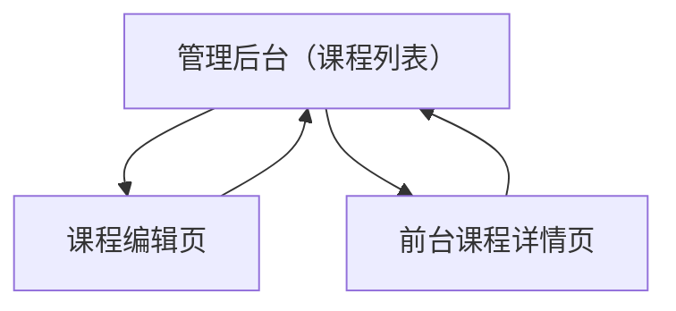

## 1. Product Overview
面向管理员的课程与视频资源管理后台，支持课程编辑、资源增删改与排序。
课程列表支持搜索/筛选/分页，并与后端接口参数与返回结构对齐。

## 2. Core Features

### 2.1 User Roles
| 角色 | 注册/进入方式 | 核心权限 |
|------|----------------|----------|
| 管理员 | 通过管理令牌（Admin Token）访问管理后台 | 可创建/编辑/删除课程；可管理课程资源（增删改、排序）；可在列表中搜索/筛选/分页浏览 |

### 2.2 Feature Module
本期需求包含以下页面：
1. **管理后台（课程列表）**：课程列表表格、搜索/筛选、分页、快捷操作（创建/删除/进入编辑）。
2. **课程编辑页**：编辑课程基本信息、资源列表管理（新增/编辑/删除）、资源排序与保存。

### 2.3 Page Details
| Page Name | Module Name | Feature description |
|-----------|-------------|---------------------|
| 管理后台（课程列表） | 权限校验与错误提示 | 校验管理员令牌；在 401/403 时提示无权限并引导重新配置令牌。 |
| 管理后台（课程列表） | 搜索 | 通过关键字搜索课程（标题）并触发列表刷新；支持回车触发与清空重置。 |
| 管理后台（课程列表） | 筛选 | 按资源类型筛选（local/youtube/bilibili/external_link）；筛选条件变化后刷新列表。 |
| 管理后台（课程列表） | 分页 | 展示页码、总数/总页数；支持切换页码、修改每页条数（如 10/20/50）。 |
| 管理后台（课程列表） | 列表表格 | 展示课程关键信息（封面/标题/描述摘要/资源数/更新时间）；点击标题进入课程编辑页。 |
| 管理后台（课程列表） | 课程快捷操作 | 创建课程入口；删除课程（二次确认）；预览课程跳转到前台详情页。 |
| 课程编辑页 | 课程信息编辑 | 编辑课程标题、封面 URL、描述；保存时进行必填校验并提交更新。 |
| 课程编辑页 | 资源列表展示 | 展示资源条目（标题、类型、来源 URL/ID、排序号）；按当前排序从上到下渲染。 |
| 课程编辑页 | 资源新增/编辑 | 新增资源：填写类型、source_url、title（可选）；编辑资源：修改上述字段并保存。 |
| 课程编辑页 | 资源删除 | 删除资源（二次确认）；删除成功后刷新资源列表与排序序号。 |
| 课程编辑页 | 资源排序 | 支持拖拽排序或"上移/下移"；保存后将新顺序提交到后端并回显。 |
| 课程编辑页 | 状态与回滚 | 保存中禁用操作；失败时展示错误原因；允许放弃更改并返回列表。 |

## 3. Core Process
**管理员流程**
1. 管理员进入"管理后台（课程列表）"。
2. 通过搜索框输入关键字，或选择资源类型筛选；列表按分页加载并展示结果。
3. 点击"创建课程"进入创建流程（可在列表页弹窗/抽屉完成创建，创建后回到列表并定位到新数据）。
4. 在列表中点击某课程进入"课程编辑页"，修改课程信息。
5. 在课程编辑页对资源进行新增/编辑/删除，并调整资源顺序。
6. 点击"保存"提交更改；成功后提示保存成功并保持当前页。

